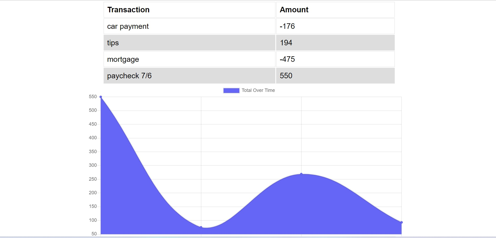

# Budget-Tracker

## Description
This application allows the user to be able to track my withdrawals and deposits with or without a data/internet connection. This allows the user to access their account balance and add transactions all while offline to ensure an accurate account statement. 

## Technologies utilized
-npm  
-mongoose  
-mongoDB 
-express.js  
-webpack.js

## Image of site

## Contributing
Erika Cannon

----
## Questions
Feedback and questions are always welcome!
[Github](https://github.com/cannnonel)
[Email](mailto:cannone.rva!gmail.com)
